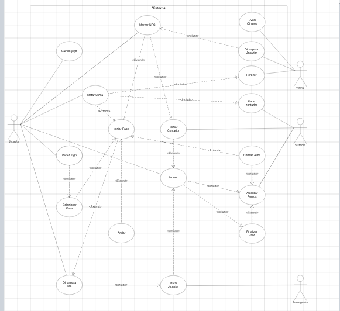
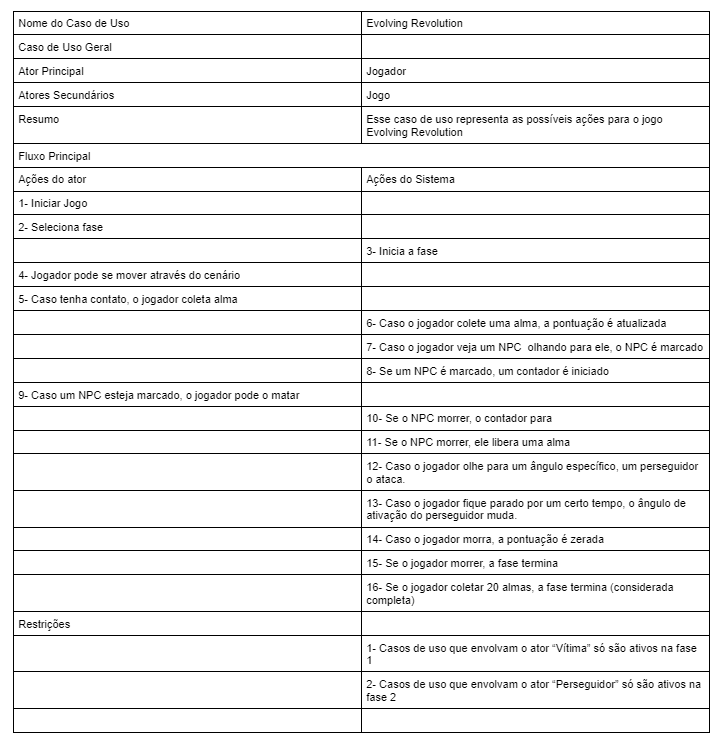
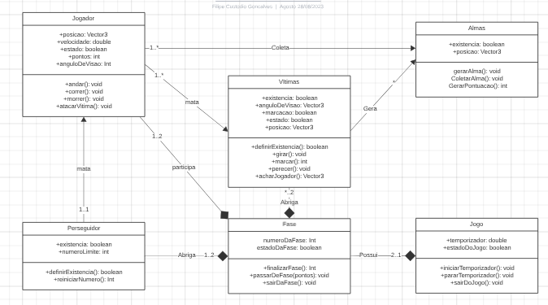
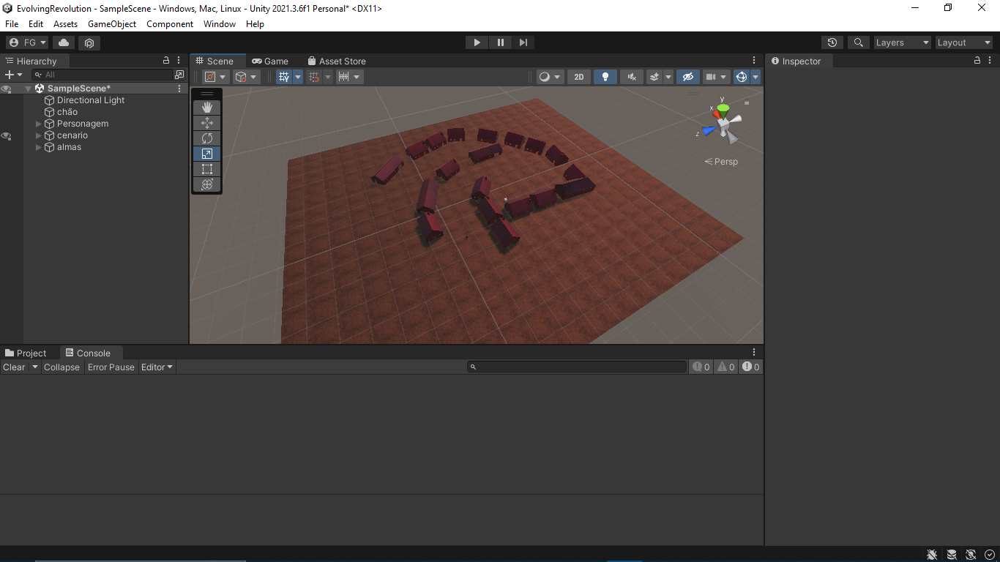
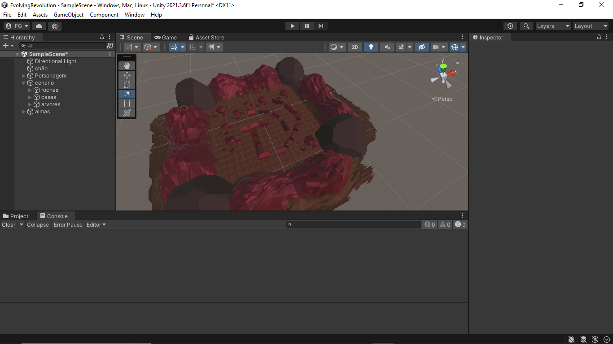
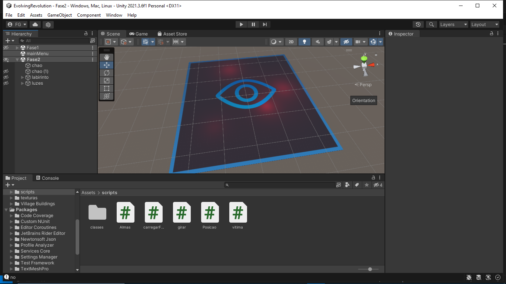
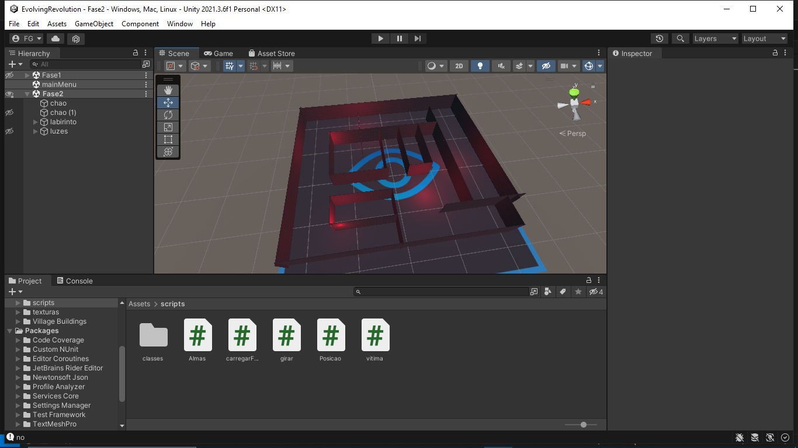
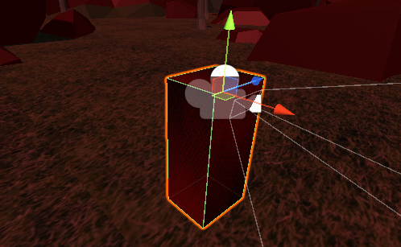
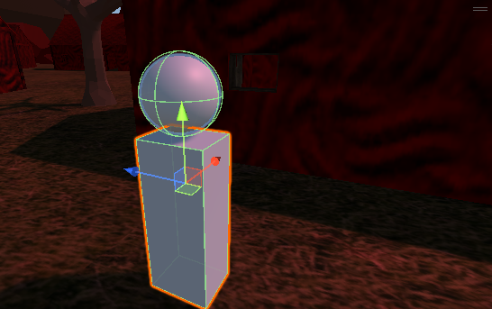

# Revolving Revolution
# Feito por:
Filipe Custodio Gonçalves - 2 Jogos Digitais

Oque é o projeto?
Este projeto feito na linguagem de C# é um jogo feito com base nas músicas "Providence" e "give and Take" da banda Poor Man's Poison.

# Tecnologias-usadas
C#

# Estado
Em progresso

Processo de desenvolvimento

# Documentação:

## Casos de Uso:

  
  
  
## UML:

  
  
  ### Definições das classes:
  
  #### Jogador
  
| Métodos  | Definição |
| ------------- | ------------- |
| Morrer()  | Método que apaga o jogador da tela da tela e notifica o jogo para terminar - ativado se passar do limite do perseguidor ou de tempo  |
| Andar()  | Método que move o personagem pelo aixo X  |
| AtacarVitima() | Método que leva a uma Vitima a perecer |

  #### Jogo
  
| Métodos  | Definição |
| ------------- | ------------- |
| IniciarTemporizador()  | Define um temporizador de 1 minuto  |
| PararTemporizador()  | Reinicia e desativa o temporizador |
| SairDoJogo() | Finaliza a execução do jogo |

  #### Fase
  
| Métodos  | Definição |
| ------------- | ------------- |
| FinalizarFase()  | Termina a fase  |
| PassarDeFase(pontos)  | Termina a fase e a marca como concluida |
| SairDaFase() | finaliza a execução da fase |

  #### Vitimas
  
| Métodos  | Definição |
| ------------- | ------------- |
| DefinirExistencia()  | Verifica se esta classe existe na fase |
| Girar()  | Rotaciona no eixo X |
| Marcar() | Ganha a definição de "Marcado" |
| Perecer() | Destroi o corpo |
| AcharJogador() | verifica a posição do jogador |

| Métodos  | Definição |
| ------------- | ------------- |
| DefinirExistencia()  | Verifica se esta classe existe na fase |
| REdefinirNumero() | Retorna um novo valor de angulo limite |

  #### Alma
  
| Métodos  | Definição |
| ------------- | ------------- |
| GerarAlma()  | Gera uma alma na posição de uma vitima que tenha perecido |
| ColetarAlma()  | Verifica se à  contato com o jogador e retira a alma da tela  |
| GerarPontuacao()  | Retorna uma pontuacao quando coletada |

# Relatorio de desenvolvimento

  O projeto tem um total de 2 cenas, ambas com criterios diferentes. A cena 1 é a maior e mais complexa, é um mapa relativamente amplo, em que o objetivo do jogador é caçar suas vitimas. Ao matar 10 vítimas, a cena é trocada.
  

  A cena 2 é bem mais simples. Um simples labirinto, com almas avulsas pelo chão. Para esta cena, o perseguidor fica ativo, impedindo que o jogador olhe para trás.

## Jogador
  "Jogador" é a classe do personagem principal. Essa classe possui como métodos principais a movimentação e o ataque a vitima. O método de manipulação manipula seus atributos de coordenadas em X e Z, um método de suporte para este é o de correr, que é ativado ao pressionar espaço. O metodo de ataque é ativado com uma tecla e quando está a uma certa distancia do alvo.
  
  

## Vitima
  "Vitima" é a classe dos NPC. Sua função não é muito evidente, elas apenas ficam paradas até morrerem pelo jogador. Quando as vitimas são mortas, elas chamam a instancia de uma nova alma para o jogador coletar. originalmente as vitimas iriam ter funções mais complexas envolvendo sua rotação e a camera do jogador.
  
  

## Alma
  "Alma" é a classe da pontuação do jogo. Seus métodos consistem na sua istancia toda vez que uma vitima morre e, sumir toda vez que entra em contato com o jogador. Esta deveria retornar um valor, oque resultaria em passar de fase, essa função foi trocada pela morte de 10 vitimas. No momento, almas são apenas decorativos.

## Fase
  "Fase" é a classe que manipula a troca de fases do jogo. O metodo de troca de fases é ativado qunado se tem menosde 10 vitimas na cena. Com essa condição atingida, o jogador é deslocado para o mapa 2 e tem a classe de perseguidor ativada.

## Perseguidor
  O perseguidor é uma classe de um corpo imaginario, é ativado quando se chega a fase dois. O perseguidor tem a ação de matar o jogador quando o mesmo olha para um certo ângulo.

## Script principal
  O script porincipalconta com algumas funções importantes. Nele se encontram todas as condições para que os devidos métodos das devidas classes serem ativados. Ele é dividido em "Posicao" para o personagem, "almas" para as almas e "vitima" para as vitimas.  

## Scripts não utilizados
  Seja por falta de conhecimento ou falta de tempo, estes scripts não puderam ser implementados no jogo
    ### Pontuação:
      A pontuação receberia +1 por toda alma coletada durante o jogo. A função foi trocada pela quantidades de vitimas mortas pois, eu não consegui fazer com que apontuação aumentasse corretamente.
    ### Jogo:
      A classe de jogo foi cortada. O jogo começãria um timer para matar as vitimas quando olhassem para você enquanto você olha para ela. Foi cortado pela dificuldade em fazer estas funções mais complexas.

      
Você pode baixar o projeto clicando <a href="https://drive.google.com/drive/folders/1AWDNZcu8nhrJSBwHbYN5tXzaKRZJpAZV?usp=sharing">AQUI</a>

Você pode ver o vídeo do projeto clicando <a href="https://www.youtube.com/watch?v=7Llk6MCayBM&t)https://www.youtube.com/watch?v=7Llk6MCayBM&t">AQUI</a>
